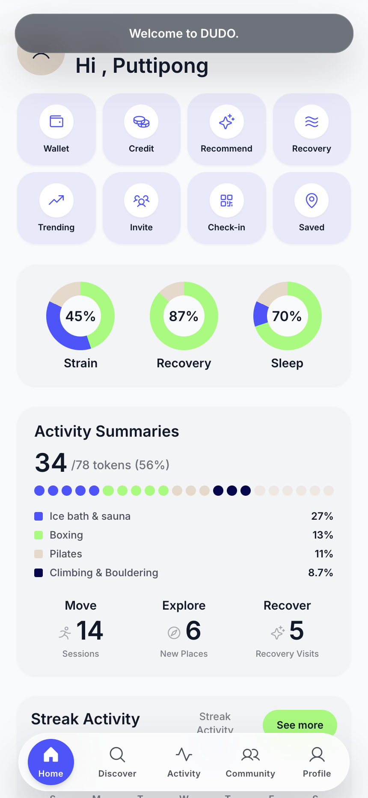
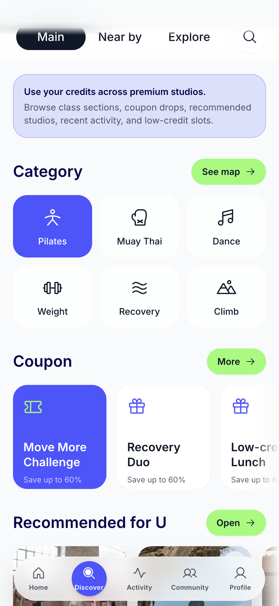
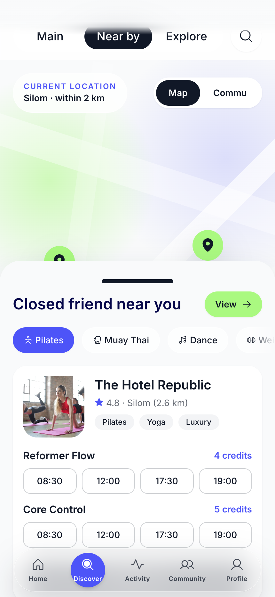
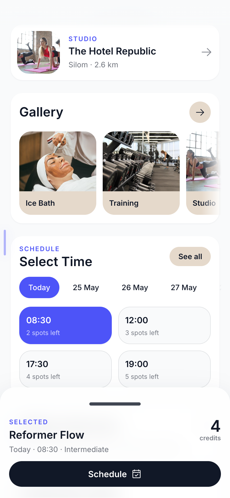
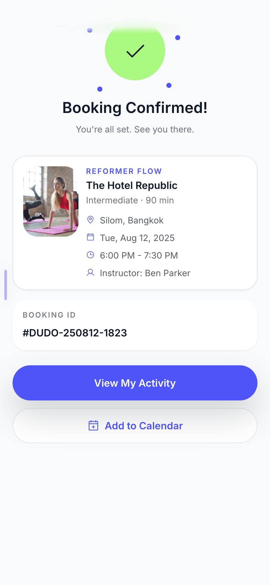
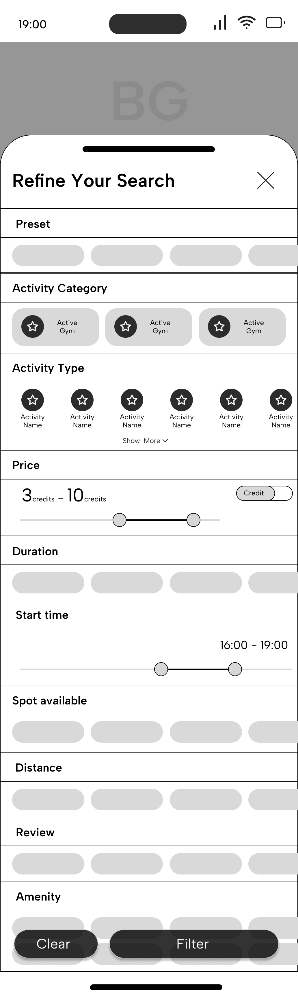
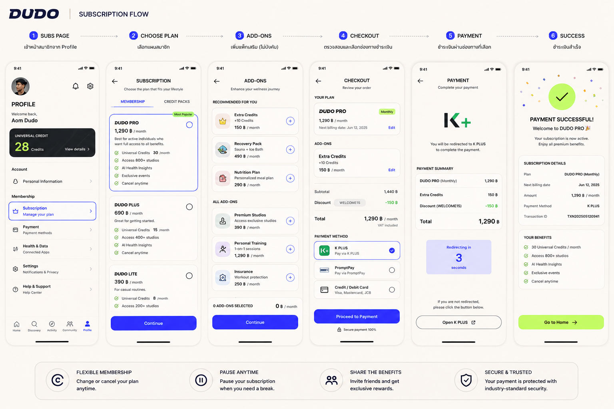
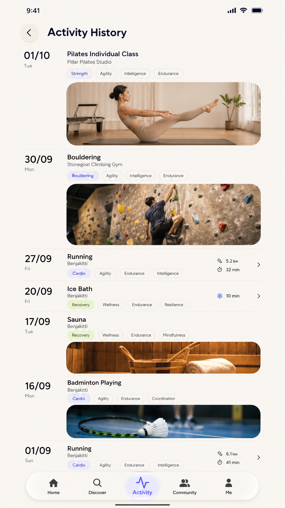

# DUDO Design System

Version: 1.0  
Status: MVP Design System for User App + Partner Portal  
Owner: Product / Design / Frontend  
Primary platforms: iPhone first, Partner Portal desktop first  
Related docs:
- [DUDO_PRD_MVP_V2.md](./DUDO_PRD_MVP_V2.md)
- [DUDO_PARTNER_PORTAL_PRD.md](./DUDO_PARTNER_PORTAL_PRD.md)
- Prototype source: `Demo application`

---

## 1. Purpose

เอกสารนี้คือ **Design System Specification** ของ DUDO ไม่ใช่ Design Brief ราย section และไม่ใช่ PRD ราย feature

Dev / Designer ต้องใช้ไฟล์นี้เป็น source of truth สำหรับ:
- สีทั้งหมดที่ใช้ใน Product
- Font, type scale, line-height, font weight
- Spacing, radius, elevation, glass effect
- Component anatomy และ state ของ component
- Pattern ของ iPhone app และ Partner Portal
- Naming convention สำหรับ Figma, CSS variables, Tailwind token
- Accessibility และ responsive rules

เป้าหมายคือให้ทุกหน้าใน DUDO ดูเป็นระบบเดียวกัน ไม่ใช่หน้าสวยแยกกันเป็นชิ้น ๆ

---

## 2. Brand Direction

### 2.1 Design Positioning

DUDO คือ wellness / sport discovery และ booking platform ที่ควรรู้สึก:
- Premium แต่ไม่ luxury จนไกลตัว
- Athletic แต่ไม่ hardcore fitness
- Social แต่ไม่รกแบบ social media หนัก ๆ
- Useful และ booking-first ไม่ใช่ content app อย่างเดียว
- มี energy จากสี accent แต่ยังอ่านง่ายในชีวิตประจำวัน

### 2.2 Visual Philosophy

ชื่อ visual language:

**Athletic Minimalist with High-Energy Accents**

แปลเป็นการออกแบบ:
- Layout สะอาด มี white / soft surface เป็นฐาน
- ใช้ `Primary Blue` สำหรับ action, navigation, selected state, credit
- ใช้ `Energy Green` สำหรับ positive / success / bookable / highlight CTA
- ใช้ sand และ light gray เป็นพื้นที่พักสายตา
- ใช้ glass layer เฉพาะจุดที่เป็น floating UI เช่น bottom nav, map overlay, photo sticker
- Card ใหญ่ โค้งมน สัมผัสแบบ mobile native
- Partner Portal ต้องลดความโค้งและความ playful ลง เพื่อให้เป็น operational tool ที่อ่านข้อมูลได้เร็ว

### 2.3 Product Personality

ควรให้ความรู้สึก:
- Fast to book
- Trustworthy with payment and refund
- Local Bangkok lifestyle
- Community-led แต่ยังไม่วุ่นวาย
- Sport data แบบ human-friendly ไม่ใช่ analytics dashboard หนัก ๆ

ไม่ควรให้ความรู้สึก:
- Crypto / fintech trading app
- Neon nightclub
- Hospital / medical app
- Enterprise admin ที่แห้งเกินไปสำหรับฝั่ง user
- Magazine app ที่จองยาก

---

## 3. Reference Board

ใช้ reference เหล่านี้เพื่อ align visual direction กับ prototype ปัจจุบัน

### 3.1 Current App Screens

| Area | Reference |
|---|---|
| Home / main dashboard | `./assets/prd/app/03_home.png` |
| Discovery main | `./assets/prd/app/04_discovery_main.png` |
| Nearby map | `./assets/prd/app/05_nearby_map.png` |
| Filter sheet | `./assets/prd/app/08_filter_sheet.png` |
| Studio detail | `./assets/prd/app/09_studio_detail.png` |
| Class detail | `./assets/prd/app/11_class_detail.png` |
| Reservation flow | `./assets/prd/app/13_reservation_sheet.png` |
| Booking confirmed | `./assets/prd/app/16_booking_confirmed.png` |
| Activity | `./assets/prd/app/17_activity.png` |
| Check-in QR | `./assets/prd/app/18_checkin_qr.png` |
| Community share | `./assets/prd/app/20_snap_share.png` |
| Subscription | `./assets/prd/app/23_subscription_plans.png` |

### 3.2 Inspiration Captures

| Pattern | Reference |
|---|---|
| Discovery feed | `./assets/prd/inspiration/discovery_main_wireframe.png` |
| Explore editorial | `./assets/prd/inspiration/discovery_explore_wireframe.png` |
| Filter bottom sheet | `./assets/prd/inspiration/filter_sheet_ui.png` |
| Activity history | `./assets/prd/inspiration/activity_history_ui.png` |
| Activity post | `./assets/prd/inspiration/activity_post_flow.png` |
| Community feed | `./assets/prd/inspiration/community_feed_wireframe.png` |
| Subscription plan | `./assets/prd/inspiration/subscription_flow.png` |
| Personal dashboard | `./assets/prd/inspiration/personal_dashboard_ui.png` |

Designers can place these images in a Figma page named:

`00 Reference Board`

The reference board is for mood and pattern alignment only. Final UI must follow the tokens in this document.

### 3.3 Visual Samples

Use these embedded samples as quick visual anchors when reading this system.

| Home | Discovery | Nearby Map |
|---|---|---|
|  |  |  |

| Reservation | Activity | Community Share |
|---|---|---|
|  |  |  |

| Filter Inspiration | Subscription Inspiration | Activity History Inspiration |
|---|---|---|
|  |  |  |

---

## 4. Token Architecture

### 4.1 Token Layers

DUDO token system has 4 layers:

1. **Primitive tokens**  
   Raw values เช่น `#4D54F8`, `16px`, `0 1px 2px rgba(...)`

2. **Semantic tokens**  
   Product meaning เช่น `color.action.primary.bg`, `color.booking.confirmed.bg`

3. **Component tokens**  
   Component-specific usage เช่น `button.primary.bg.default`, `card.place.radius`

4. **Platform tokens**  
   Different density by product area เช่น `mobile.radius.card`, `portal.radius.card`

Dev must not hardcode random hex in feature files. ถ้าต้องใช้สีใหม่ ให้เพิ่ม token ก่อน

### 4.2 Naming Convention

Use dot naming in documentation / Figma variables:

```text
color.brand.primary.500
color.semantic.success.bg
space.4
radius.mobile.card
elevation.card.soft
component.button.primary.bg.default
```

Use CSS variable naming in implementation:

```css
--dudo-color-brand-primary-500
--dudo-color-success-bg
--dudo-space-4
--dudo-radius-mobile-card
--dudo-elevation-card-soft
```

Use Tailwind aliases only as an implementation convenience:

```js
primary.500 = "#4D54F8"
accent.500 = "#AAF980"
sand.300 = "#E5D9CB"
ink.900 = "#111827"
```

---

## 5. Color System

### 5.1 Core Brand Colors

| Token | Hex | Usage |
|---|---:|---|
| `color.brand.primary.500` | `#4D54F8` | Main brand, selected state, primary CTA, credit badge, active nav |
| `color.brand.primary.900` | `#06074A` | Deep brand, app frame desktop bg, high contrast headline, premium dark surfaces |
| `color.brand.accent.500` | `#AAF980` | High-energy CTA, success highlight, bookable slot, positive metric |
| `color.neutral.ink.900` | `#111827` | Main text, dark button, QR, critical UI contrast |
| `color.neutral.sand.300` | `#E5D9CB` | Soft neutral chip, avatar bg, calm filter backgrounds |
| `color.surface.app` | `#F9FAFB` | Main app background |
| `color.surface.soft` | `#F3F4F6` | Soft panel, chart background, empty surface |
| `color.surface.white` | `#FFFFFF` | Card base, input base, portal table surface |

### 5.2 Extended Brand Scale

These values should be added for production so components can avoid opacity hacks.

| Token | Hex | Usage |
|---|---:|---|
| `color.primary.50` | `#F0F1FF` | Primary tinted background |
| `color.primary.100` | `#E2E4FF` | Light selected chip bg |
| `color.primary.200` | `#C8CBFF` | Soft border / hover bg |
| `color.primary.300` | `#9FA5FF` | Chart secondary line |
| `color.primary.400` | `#737BFF` | Hover primary |
| `color.primary.500` | `#4D54F8` | Base |
| `color.primary.600` | `#3840E8` | Pressed primary |
| `color.primary.700` | `#2930C8` | Dark active |
| `color.primary.800` | `#181E8E` | Deep control |
| `color.primary.900` | `#06074A` | Deep brand |

| Token | Hex | Usage |
|---|---:|---|
| `color.accent.50` | `#F4FFE9` | Light success bg |
| `color.accent.100` | `#E8FFD5` | Positive panel bg |
| `color.accent.200` | `#D7FFB6` | Selected calendar soft bg |
| `color.accent.300` | `#C5FF98` | Hover accent |
| `color.accent.500` | `#AAF980` | Base |
| `color.accent.600` | `#82D957` | Pressed accent |
| `color.accent.700` | `#4F9E2D` | Accessible green text on light bg |

### 5.3 Neutral Scale

| Token | Hex | Usage |
|---|---:|---|
| `color.gray.0` | `#FFFFFF` | Card and modal |
| `color.gray.25` | `#FCFCFD` | Portal background |
| `color.gray.50` | `#F9FAFB` | App background |
| `color.gray.100` | `#F3F4F6` | Soft section |
| `color.gray.200` | `#E5E7EB` | Border |
| `color.gray.300` | `#D1D5DB` | Disabled border |
| `color.gray.400` | `#9CA3AF` | Placeholder |
| `color.gray.500` | `#6B7280` | Secondary text |
| `color.gray.600` | `#4B5563` | Body secondary |
| `color.gray.700` | `#374151` | Strong body |
| `color.gray.800` | `#1F2937` | Deep surface |
| `color.gray.900` | `#111827` | Main text |

### 5.4 Semantic Colors

| Semantic | Token | Hex | Usage |
|---|---|---:|---|
| Success bg | `color.success.bg` | `#E9FFD8` | Booking confirmed bg, Apple Health connected |
| Success text | `color.success.text` | `#287A16` | Positive label on light bg |
| Success solid | `color.success.solid` | `#AAF980` | Big success accent |
| Warning bg | `color.warning.bg` | `#FFF4CC` | Low credit, pending partner confirmation |
| Warning text | `color.warning.text` | `#8A5A00` | Warning label |
| Error bg | `color.error.bg` | `#FFE4E6` | Payment failed, cancellation alert |
| Error text | `color.error.text` | `#BE123C` | Destructive text |
| Error solid | `color.error.solid` | `#E11D48` | Destructive button |
| Info bg | `color.info.bg` | `#E8F0FF` | New update, external calendar sync |
| Info text | `color.info.text` | `#3150C8` | Info label |
| Pending bg | `color.pending.bg` | `#F2ECDF` | Waitlist, review pending |
| Pending text | `color.pending.text` | `#6B4F25` | Pending label |

### 5.5 Booking Status Colors

| Status | Background | Text | Icon |
|---|---|---|---|
| Available | `color.accent.100` | `color.neutral.ink.900` | Check / plus |
| Few left | `color.warning.bg` | `color.warning.text` | Clock |
| Full | `color.gray.100` | `color.gray.500` | Lock |
| Waitlist | `color.pending.bg` | `color.pending.text` | Hourglass |
| Booked | `color.primary.500` | `#FFFFFF` | Ticket |
| Checked in | `color.success.bg` | `color.success.text` | Check circle |
| Cancelled | `color.gray.100` | `color.gray.500` | X circle |
| Refunded | `color.info.bg` | `color.info.text` | Arrow counter-clockwise |
| No-show | `color.error.bg` | `color.error.text` | Alert |

### 5.6 Payment Status Colors

| Status | Background | Text | Rule |
|---|---|---|---|
| Paid | `color.success.bg` | `color.success.text` | Show receipt link |
| Subscription credit used | `color.primary.50` | `color.primary.700` | Show credit amount |
| Cash payable at venue | `color.pending.bg` | `color.pending.text` | Show "Pay at venue" clearly |
| Pending payment | `color.warning.bg` | `color.warning.text` | Time-sensitive |
| Payment failed | `color.error.bg` | `color.error.text` | Retry CTA |
| Refund processing | `color.info.bg` | `color.info.text` | Include ETA |
| Fully refunded | `color.success.bg` | `color.success.text` | "Full refund completed" |

### 5.7 Color Usage Rules

Primary blue:
- Use for selected tabs, active nav, main progress, credit identity, primary booking CTA
- Do not use for every icon on the screen
- Avoid large full-screen blue backgrounds except special onboarding / success moments

Accent green:
- Use for high intent action: Book, Confirm, Success, Available, Share completion
- Do not use as paragraph text
- Do not put white text on accent green; use ink `#111827`

Sand:
- Use for neutral chips, avatar placeholders, soft filter states
- Do not make entire screens beige/sand

Dark ink:
- Use for text, dark button, QR, high contrast portal labels
- Do not use black `#000000` except simulated iPhone notch / QR internal blocks

Glass:
- Use when element floats above content, map, or imagery
- Do not use glass for dense portal tables

---

## 6. Typography System

### 6.1 Font Family

Current prototype:

```css
font-family: "Inter", ui-sans-serif, system-ui, sans-serif;
```

Production recommendation:

```css
font-family: "Inter", "Noto Sans Thai", ui-sans-serif, system-ui, sans-serif;
```

Rules:
- Use Inter for English UI
- Add Noto Sans Thai or LINE Seed Sans TH if Thai copy becomes part of production
- Do not mix decorative fonts
- Do not use negative letter spacing
- Letter spacing default must be `0`
- Uppercase eyebrow can use tracking only when text is short

### 6.2 Mobile Type Scale

| Role | Token | Size | Weight | Line-height | Usage |
|---|---|---:|---:|---:|---|
| Display | `type.mobile.display` | 40px | 700 | 0.95 | Rare onboarding hero only |
| Page title XL | `type.mobile.title.xl` | 34px | 650 | 1.00 | Home / major page title |
| Page title LG | `type.mobile.title.lg` | 28px | 650 | 1.02 | Subpage title |
| Section title | `type.mobile.section` | 24px | 600 | 1.00 | Section header |
| Card title | `type.mobile.card.title` | 18px | 500 | 1.20 | Studio card / booking card |
| Body | `type.mobile.body` | 16px | 400 | 1.50 | Main readable copy |
| Body compact | `type.mobile.body.compact` | 14px | 400 | 1.45 | Card metadata |
| Label | `type.mobile.label` | 14px | 600 | 1.20 | Button / chip |
| Caption | `type.mobile.caption` | 12px | 500 | 1.20 | Helper, timestamp |
| Micro | `type.mobile.micro` | 10px | 600 | 1.10 | Bottom nav label |

### 6.3 Partner Portal Type Scale

Portal is denser and less expressive than mobile.

| Role | Token | Size | Weight | Line-height | Usage |
|---|---|---:|---:|---:|---|
| Portal H1 | `type.portal.h1` | 28px | 650 | 1.15 | Dashboard page title |
| Portal H2 | `type.portal.h2` | 22px | 600 | 1.20 | Section header |
| Portal H3 | `type.portal.h3` | 18px | 600 | 1.25 | Panel title |
| Portal body | `type.portal.body` | 14px | 400 | 1.45 | Tables, forms |
| Portal label | `type.portal.label` | 13px | 600 | 1.20 | Field label |
| Portal caption | `type.portal.caption` | 12px | 500 | 1.20 | Metadata |
| Portal table | `type.portal.table` | 13px | 400 | 1.35 | Dense operational table |

### 6.4 Text Color Roles

| Token | Value | Usage |
|---|---|---|
| `color.text.primary` | `#111827` | Main text |
| `color.text.brand` | `#06074A` | Headline / DUDO identity |
| `color.text.secondary` | `rgba(17, 24, 39, 0.72)` | Metadata |
| `color.text.tertiary` | `rgba(17, 24, 39, 0.52)` | Helper |
| `color.text.disabled` | `rgba(17, 24, 39, 0.36)` | Disabled |
| `color.text.inverse` | `#FFFFFF` | Text on dark / primary |
| `color.text.accent-on-green` | `#111827` | Text on accent green |

### 6.5 Copy Rules

Button labels:
- Use verbs: `Book`, `Confirm`, `Check in`, `Share`, `Save`
- Avoid vague text: `Submit`, `Next` when a specific action is known

Payment:
- Always distinguish:
  - `Pay with credits`
  - `Pay now`
  - `Pay at venue`
  - `Full refund if partner rejects`

Booking:
- Always show date, time, venue, cancellation condition before confirm
- If partner confirmation is required, label it before payment confirmation

---

## 7. Spacing System

### 7.1 Base Scale

Base unit is 4px.

| Token | Value | Usage |
|---|---:|---|
| `space.0` | 0px | No spacing |
| `space.1` | 4px | Tiny gap |
| `space.2` | 8px | Icon/text gap |
| `space.3` | 12px | Compact internal padding |
| `space.4` | 16px | Standard card padding |
| `space.5` | 20px | Mobile page side padding |
| `space.6` | 24px | Section gap |
| `space.8` | 32px | Major block spacing |
| `space.10` | 40px | Large vertical break |
| `space.12` | 48px | Hero spacing |
| `space.16` | 64px | Portal major spacing |

### 7.2 Mobile Layout Spacing

| Area | Value |
|---|---:|
| Page horizontal padding | 20px |
| Top safe area padding | `max(32px, safe-area + 16px)` |
| Bottom nav clearance | `106px + safe-area-bottom` |
| Card internal padding | 16px |
| Large card internal padding | 20px |
| Section vertical gap | 24px |
| Card-to-card list gap | 12px or 16px |
| Horizontal carousel gap | 12px |
| Bottom sheet horizontal padding | 20px |

### 7.3 Portal Layout Spacing

| Area | Value |
|---|---:|
| Page outer padding desktop | 32px |
| Page outer padding tablet | 24px |
| Sidebar width | 248px |
| Top bar height | 64px |
| Dashboard grid gap | 20px |
| Panel padding | 20px |
| Dense form gap | 12px |
| Table cell vertical padding | 10px |
| Table cell horizontal padding | 12px |

### 7.4 Spacing Rules

- Do not use arbitrary spacing unless unavoidable
- Mobile pages should feel airy, but lists must remain scannable
- Portal pages should be denser than app pages
- Same component type must use same padding across product
- Avoid nesting cards inside cards; use section gaps instead

---

## 8. Radius System

### 8.1 Mobile Radius

Current prototype uses larger tactile radii.

| Token | Value | Usage |
|---|---:|---|
| `radius.mobile.xs` | 8px | QR cells, small media |
| `radius.mobile.sm` | 16px | Small icon tile |
| `radius.mobile.md` | 22px | Main card, image, input |
| `radius.mobile.lg` | 28px | Soft card, chart surface |
| `radius.mobile.xl` | 34px | Large sheet / hero card |
| `radius.mobile.sheet` | 36px top | Bottom sheet top corners |
| `radius.mobile.full` | 999px | Buttons, chips, avatars |

### 8.2 Portal Radius

Portal must be calmer and more operational.

| Token | Value | Usage |
|---|---:|---|
| `radius.portal.xs` | 4px | Checkbox, tiny badge |
| `radius.portal.sm` | 6px | Table tags |
| `radius.portal.md` | 8px | Buttons, inputs |
| `radius.portal.lg` | 12px | Panels |
| `radius.portal.xl` | 16px | Dashboard cards |
| `radius.portal.full` | 999px | Pills, avatars |

### 8.3 Radius Rules

- Mobile app can use 22px and 28px as signature shapes
- Portal should not use 22px for tables or forms
- Images should share radius with the card they belong to unless they are avatar/story circles
- Button radius is always full pill on mobile
- Portal buttons use 8px unless they are filter pills

---

## 9. Elevation & Shadow

### 9.1 Shadow Tokens

| Token | Value | Usage |
|---|---|---|
| `elevation.none` | `none` | Flat portal tables |
| `elevation.button.soft` | `0 1px 2px rgba(17,24,39,0.05)` | Buttons, icon buttons |
| `elevation.card.subtle` | `0 12px 28px rgba(17,24,39,0.08)` | Standard white card |
| `elevation.card.soft` | `0 16px 34px rgba(17,24,39,0.08)` | DUDO card |
| `elevation.card.raised` | `0 18px 38px rgba(17,24,39,0.10)` | Feature card |
| `elevation.modal` | `0 24px 48px rgba(17,24,39,0.18)` | Sheet / modal |
| `elevation.brand` | `0 22px 42px rgba(77,84,248,0.28)` | Brand card / primary confirmation |
| `elevation.phone.frame` | `0 40px 80px rgba(0,0,0,0.45)` | Desktop prototype shell only |

### 9.2 Elevation Rules

- Mobile cards can use soft shadow to feel tactile
- Portal tables should use border before shadow
- Do not combine heavy shadow with heavy border
- Use brand shadow only for rare high-value primary moments
- Bottom sheet shadow must be stronger than cards

---

## 10. Glass System

### 10.1 Glass Tokens

| Token | CSS | Usage |
|---|---|---|
| `effect.glass.light` | `rgba(255,255,255,0.76); blur(18px); border rgba(255,255,255,0.5)` | Bottom nav, map controls, photo overlay |
| `effect.glass.dark` | `rgba(17,24,39,0.60); blur(16px); border rgba(255,255,255,0.1)` | Share sticker on photo, toast |
| `effect.glass.brand` | `rgba(77,84,248,0.16); blur(14px); border rgba(77,84,248,0.3)` | Brand overlay, selected map cluster |

### 10.2 Glass Usage Rules

Use glass for:
- Floating bottom navigation
- Map overlay / venue preview
- Image card status labels
- Toast
- Share preview stickers

Do not use glass for:
- Long text panels
- Partner Portal dense dashboard
- Payment confirmation legal details
- Forms with many fields

Fallback:
- If backdrop-filter is unsupported, use solid white `rgba(255,255,255,0.94)` or ink `rgba(17,24,39,0.88)`

---

## 11. Iconography

### 11.1 Icon Library

Current prototype uses Phosphor icons:

```html
@phosphor-icons/web
```

Rule:
- Use one icon family only within production
- Do not mix Phosphor and Lucide in the same product release unless migration is planned
- If migrating to another icon library, map all icon names in one pass

### 11.2 Icon Sizes

| Token | Size | Usage |
|---|---:|---|
| `icon.xs` | 14px | Inline metadata |
| `icon.sm` | 16px | Portal table action |
| `icon.md` | 20px | Button leading icon |
| `icon.lg` | 24px | Mobile nav / icon button |
| `icon.xl` | 32px | Feature icon tile |

### 11.3 Icon Rules

- Icon-only buttons must have accessible label
- Active icon may use filled style
- Inactive icon should use regular outline
- Use icon + text for important action buttons
- Use icon-only for repeated controls like favorite, close, back, more

---

## 12. Layout System

### 12.1 Mobile App Shell

Current shell:
- Width: `100%`
- Max width: `640px`
- Height: `100dvh`
- Background: `#F9FAFB`
- iPhone prototype desktop frame radius: `44px`
- Desktop preview background: `#06074A`

Mobile layout rules:
- Design primary artboard at 390px width
- Check 375px, 390px, 430px, and 640px max shell
- All primary controls must fit in thumb zone
- Bottom nav must not cover content
- Main content padding bottom must include nav clearance
- Avoid fixed full height sections unless they account for safe area

### 12.2 Mobile Navigation

Bottom nav:
- Position: fixed bottom
- Width: `min(90vw, 390px)`
- Height per nav item: 54px
- Shape: pill
- Surface: glass-light
- Active item: primary blue bg, white text
- Inactive item: ink with 75% opacity

Nav tabs:
- Home
- Discovery
- Activity
- Community
- Profile

Rules:
- Do not add more than 5 tabs
- Do not show text labels longer than 10 characters
- Active nav must be visually obvious without relying only on icon fill

### 12.3 Partner Portal Shell

Desktop first:
- Recommended min layout width: 1280px
- Main target: 1440px
- Sidebar: 248px
- Top bar: 64px
- Main content: flexible, max content width optional for settings forms
- Background: `color.gray.25` or `color.gray.50`

Portal layout:

```text
+----------------+--------------------------------+
| Sidebar        | Top Bar                        |
|                +--------------------------------+
|                | Page Header                    |
|                | Dashboard Cards / Panels       |
|                | Tables / Calendar / Forms      |
+----------------+--------------------------------+
```

Rules:
- Portal is a working tool, not a marketing page
- Avoid oversized hero sections
- Use tables, calendar grids, split panels, and drawers
- Keep repeated actions in predictable places

### 12.4 Portal Breakpoints

| Breakpoint | Width | Behavior |
|---|---:|---|
| Mobile fallback | `<768px` | Show read-only compact view or unsupported notice for heavy ops |
| Tablet | `768-1023px` | Collapsed sidebar, full-width panels |
| Desktop | `1024-1439px` | Sidebar + content |
| Wide | `>=1440px` | Full dashboard grid |

MVP portal should optimize for desktop. Mobile portal can be limited but must not break.

---

## 13. Component System

### 13.1 Buttons

### Button Sizes

| Size | Height | Padding | Text |
|---|---:|---:|---|
| Mobile sm | 40px | 16px | 14px / 600 |
| Mobile md | 48px | 20px | 15px / 600 |
| Mobile lg | 56px | 24px | 16px / 600 |
| Portal sm | 32px | 12px | 13px / 600 |
| Portal md | 40px | 16px | 14px / 600 |
| Portal lg | 48px | 20px | 15px / 600 |

### Button Variants

Primary:
- Default bg: `color.primary.500`
- Text: white
- Hover: `color.primary.400`
- Pressed: `color.primary.600`
- Disabled: bg `color.gray.200`, text `color.gray.500`
- Use for: confirm booking, continue payment, save major form

Accent:
- Default bg: `color.accent.500`
- Text: `color.neutral.ink.900`
- Hover: `color.accent.300`
- Pressed: `color.accent.600`
- Use for: book available, share completed, positive action

Dark:
- Default bg: `color.neutral.ink.900`
- Text: white
- Use for: clear filters, secondary strong action, portal destructive confirmation background only if not destructive

Secondary:
- Bg: white
- Border: `rgba(17,24,39,0.10)`
- Text: `color.primary.500` or ink depending context
- Use for: add calendar, edit, change slot

Ghost:
- Bg: transparent
- Text: primary or ink
- Use for: tertiary actions

Destructive:
- Bg: `color.error.solid`
- Text: white
- Use for: cancel session, reject booking, delete

### Button State Rules

Loading:
- Keep button width stable
- Replace leading icon with spinner
- Label should describe process: `Confirming...`, `Processing refund...`

Disabled:
- Must include reason near component if action is important
- Example: "Not enough credits" or "Slot is full"

Pressed:
- Mobile can scale to `0.97`
- Portal should use color/shadow only, no large scale effect

Focus:
- Keyboard focus ring: `0 0 0 3px rgba(77,84,248,0.24)`

---

### 13.2 Icon Buttons

Mobile:
- Size: 48px
- Shape: full circle
- Bg: white or glass-light
- Icon: 24px
- Shadow: `elevation.button.soft`

Portal:
- Size: 32px or 36px
- Radius: 8px or full if circular action
- Bg: transparent / gray hover

Common icons:
- Back
- Close
- Favorite / saved
- Share
- More
- Filter
- Calendar
- Map

Rules:
- Every icon button needs `aria-label`
- Close should always be top right in modal/sheet
- Back should be top left in subpage

---

### 13.3 Chips & Pills

### Filter Chip

Default:
- Height: 40px mobile, 32px portal
- Bg: white / transparent
- Border: `color.primary.500` at 20% opacity
- Text: ink 75%

Selected:
- Bg: `color.primary.500`
- Text: white
- Border: primary
- Optional leading check icon

Disabled:
- Bg: `color.gray.100`
- Text: `color.gray.400`

Used for:
- Area
- Activity category
- Booking type
- Time of day
- Credits range
- Payment method

### Status Pill

Shape: full pill  
Text: 12px / 600  
Padding: 8px horizontal mobile, 6-8px portal  

Status pill must map to semantic color table in section 5.

---

### 13.4 Segmented Control

Used for:
- Booking method: `Subscription credits` / `Pay now`
- Discovery: `Nearby` / `Explore`
- Partner inventory: `Classes` / `Courts` / `Passes`
- Portal calendar view: `Day` / `Week` / `Month`

Mobile:
- Height: 44px
- Container: white or sand
- Radius: full
- Selected item: primary or white pill with shadow depending context

Portal:
- Height: 36px
- Radius: 8px
- Selected item: white + border or primary tint

Rules:
- 2-4 options max
- Selected item must have text contrast
- Do not use segmented control for long lists

---

### 13.5 Cards

### Standard Mobile Card

Token:
- Radius: `radius.mobile.md` = 22px
- Bg: white 86-100%
- Border: optional white translucent border
- Shadow: `elevation.card.soft`
- Padding: 16px

Used for:
- Booking summary
- Upcoming action
- Subscription plan
- Venue preview

### Soft Mobile Card

Token:
- Radius: `radius.mobile.lg` = 28px
- Bg: white/light gradient
- Shadow: `elevation.card.raised`
- Padding: 20px

Used for:
- Wellness chart
- Profile metric
- Dashboard summary

### Image Card

Anatomy:
- Image full width or fixed thumbnail
- Radius: 22px
- Overlay badges allowed
- Text metadata below or over image depending density

Required content for venue/class image card:
- Venue/class name
- Area
- Price or credits
- Rating if available
- Save/favorite action

### Partner Portal Panel

Token:
- Radius: 12px or 16px
- Bg: white
- Border: `color.gray.200`
- Shadow: none or subtle
- Padding: 20px

Rules:
- Portal panels can contain tables/forms
- Do not use glossy glass
- Use clear header/action area

---

### 13.6 Venue Card

Used in:
- Home recommendation
- Discovery main
- Nearby list
- Community place attachment

Anatomy:
1. Image
2. Save button
3. Optional rating badge
4. Venue name
5. Area + distance
6. Price/credit or payment mode
7. Category tags
8. Primary action: `Book`, `View`, or `Save`

States:
- Default
- Saved
- Partner verified
- Fully booked today
- Has promo: not MVP, avoid for now
- Has community review

MVP rules:
- Must distinguish partner venue from non-partner / reviewed place
- Partner venue can show booking CTA
- Community reviewed place can show content/review but not booking CTA unless partner inventory exists

---

### 13.7 Class / Session Card

Used for fixed-time classes.

Required fields:
- Class name
- Venue
- Instructor if available
- Date
- Start/end time
- Remaining slots
- Credit price and/or cash price
- Confirmation mode: instant or partner-confirmed

States:
- Available
- Few left
- Full
- Waitlist
- Booked
- Cancelled by partner
- Cancelled by user

CTA logic:
- Available + enough credits: `Book with credits`
- Available + pay now: `Pay now`
- Available + cash allowed: `Reserve, pay at venue`
- Full: disabled `Full`
- Partner confirmation required: `Request booking`

---

### 13.8 Court / Resource Slot Card

Used for court management such as tennis, badminton, squash, etc.

Required fields:
- Court/resource name
- Venue
- Date
- Start time
- Duration
- Capacity or player count if relevant
- Price per slot
- Availability

Visual pattern:
- Use calendar grid or horizontal time slots
- Available slots: accent tint
- Selected slot: primary solid
- Unavailable: gray disabled
- Maintenance block: warning or neutral stripe

Portal must allow:
- Create resource
- Set operating hours
- Set slot duration
- Block time
- Override availability
- Cancel specific booking
- Cancel entire block/session

---

### 13.9 Pass Card

Used for day pass, 3-pass, class package, open gym.

Required fields:
- Pass name
- Venue
- Validity date/time
- Number of uses
- Included access
- Exclusions
- Price cash and/or credit
- Refund/cancellation rule

Visual pattern:
- Use ticket-like card only if it does not reduce readability
- Show validity clearly near top
- Show remaining uses after purchase

States:
- Available
- Active
- Partially used
- Expired
- Refunded

---

### 13.10 Booking Summary Card

Used before confirm, after confirm, activity detail.

Required fields:
- Image thumbnail
- Class/pass/court name
- Venue name
- Area
- Date/time
- User count if relevant
- Payment method
- Credit/cash amount
- Cancellation/refund rule

Do not hide payment method behind icons. For MVP, payment trust is more important than compactness.

---

### 13.11 Payment Method Selector

MVP supports:
1. Subscription credits
2. Pay now
3. Cash / pay at venue, only when partner allows

Anatomy:
- Segmented or stacked radio cards
- Method name
- Balance / price
- Terms line
- Disabled reason

Rules:
- If credits insufficient, show disabled credit method with `Buy credits` or `Choose pay now`
- If cash not accepted by venue, hide or disable cash method with reason
- If partner rejects pay-now booking, refund rule must be displayed before confirmation

Copy examples:
- `Use 8 credits`
- `Pay ฿650 now`
- `Reserve and pay at venue`
- `Full refund if the partner cannot accept this booking`

---

### 13.12 Forms & Inputs

### Mobile Inputs

Height:
- Text input: 48px
- Textarea min: 96px
- Search: 48px

Style:
- Radius: 22px or full for search
- Bg: white
- Border: `rgba(17,24,39,0.10)`
- Focus: primary border
- Placeholder: `color.gray.400`

### Portal Inputs

Height:
- Default: 40px
- Compact: 36px
- Textarea min: 96px

Style:
- Radius: 8px
- Bg: white
- Border: `color.gray.200`
- Focus ring: primary 24%

Required form states:
- Default
- Hover
- Focus
- Filled
- Error
- Disabled
- Read-only
- Loading validation

Error format:
- Border: error
- Helper text below field
- Do not rely on red border only

---

### 13.13 Toggle / Checkbox / Radio

Toggle mobile:
- Width: 56px
- Height: 32px
- On bg: accent
- Off bg: sand
- Knob: white

Toggle portal:
- Width: 44px
- Height: 24px
- On bg: primary
- Off bg: gray 300

Use toggles for:
- Apple Health sync permission display
- Notification setting
- Partner availability active/inactive
- Cash accepted on/off

Use checkbox for:
- Multi-select filters
- Agree to terms
- Bulk selection in portal tables

Use radio for:
- Payment method
- One plan selection
- Single booking policy

---

### 13.14 Bottom Sheet

Used heavily in mobile app.

Anatomy:
1. Backdrop
2. Drag handle
3. Title row
4. Content
5. Sticky footer CTA when needed

Style:
- Radius top: 36px
- Bg: `#F9FAFB`
- Shadow: modal
- Max width: 430px / max-md
- Animation: slide up 320ms

Rules:
- Use bottom sheet for filters, reservation, payment method, quick actions
- Use full page for complex flows with many steps
- Sticky footer must include safe-area bottom
- Backdrop tap can close only if no unsaved destructive state

---

### 13.15 Modal / Drawer

Mobile:
- Prefer full-screen modal for review, share, gallery
- Use bottom sheet for simple choices

Portal:
- Use right drawer for create/edit session
- Use center modal for destructive confirm
- Use full page for complex setup like operating hours if needed

Portal drawer:
- Width: 480px standard
- Width: 640px for complex session/court setup
- Header height: 64px
- Footer action bar: sticky bottom

---

### 13.16 Tables

Portal tables are core.

Table anatomy:
- Header row
- Sortable columns where useful
- Filter/search row above table
- Row action menu
- Bulk selection checkbox for supported actions
- Empty state
- Pagination or infinite list, choose one per page

Default row height:
- 48px standard
- 40px dense

Booking management table columns:
- Booking ID
- Customer
- Activity / resource
- Date/time
- Payment method
- Status
- Partner action
- Last updated

Session table columns:
- Session
- Type
- Date/time
- Capacity
- Booked
- Status
- Source calendar
- Actions

Rules:
- Status must be pill, not plain text only
- Destructive actions must be behind menu or confirmation
- Inline edit only for simple values
- Complex edit opens drawer

---

### 13.17 Calendar / Scheduler

Used in Partner Portal for sessions, courts, passes availability.

Views:
- Day
- Week
- Month optional post-MVP
- Resource view for courts

Visual rules:
- Class sessions: primary border / light fill
- Court bookings: accent fill when booked/available depending view
- Blocked time: gray stripe
- Maintenance: warning stripe
- Cancelled: muted gray with strike label
- External calendar event: info border + calendar icon

Interaction:
- Click empty slot to create
- Click event to view/edit
- Drag to reschedule only if MVP scope allows; otherwise use edit drawer
- Conflict must be highlighted before saving

---

### 13.18 Toast / Alert

Toast:
- Position mobile: top center below safe area
- Bg: glass-dark
- Text: white
- Radius: full or 18px
- Duration: 3 seconds

Use toast for:
- Saved place
- Booking requested
- Link copied
- Post shared

Alert banner:
- Use inline banner for important persistent info
- Payment/refund info must use banner, not only toast

---

### 13.19 Empty States

Empty state anatomy:
- Icon / small illustration
- Title
- Short explanation
- Primary CTA if useful

Examples:
- No upcoming bookings: `No bookings yet` + `Explore classes`
- No Apple Health data: `Connect Apple Health` + `Connect`
- No partner sessions: `Create your first session` + `Create session`
- No court availability: `No slots available` + alternate date selector

Style:
- Mobile: soft card with icon tile
- Portal: inline panel with subtle border

---

### 13.20 Loading States

Mobile:
- Skeleton cards for lists
- Spinner only for short inline actions
- Preserve layout height

Portal:
- Table skeleton rows
- Button spinner for save actions
- Full-page loader only on first auth load

Rules:
- Do not show blank white screens
- Loading state should match final component dimensions
- Payment and booking actions must prevent double submit

---

## 14. Data Visualization

### 14.1 MVP Health Visualization

MVP reads Apple Health data and visualizes it in DUDO. It is not live tracking.

Data types likely included:
- Steps
- Active energy
- Workout minutes
- Heart rate if permission granted
- Recent workouts

Visual style:
- Minimal chart
- No heavy grid lines
- Use large human-readable metric
- Use primary for main trend
- Use accent for positive change
- Use gray for background bars

Chart components:
- Metric card
- Weekly bar chart
- Progress ring
- Simple line chart
- Activity history list

Rules:
- Do not imply medical diagnosis
- If Apple Health permission missing, show connect state
- If partial data, show available metrics and label missing data clearly

### 14.2 Chart Tokens

| Token | Value | Usage |
|---|---|---|
| `chart.primary` | `#4D54F8` | Main metric |
| `chart.accent` | `#AAF980` | Positive metric |
| `chart.hot` | `#EC4899` | High intensity / optional |
| `chart.neutral` | `#D1D5DB` | Baseline |
| `chart.surface` | `#FFFFFF` | Chart card |
| `chart.grid` | `rgba(17,24,39,0.06)` | Minimal grid only |

---

## 15. Image & Media System

### 15.1 Image Usage

Images are required for:
- Venue cards
- Studio detail
- Class detail
- Community post
- Share preview
- Explore editorial

Rules:
- Use real venue/activity imagery when possible
- Avoid purely abstract stock imagery
- Do not over-darken images
- Overlay text must have readable glass/dark backing
- Crop important subject safely across 375-430px width

### 15.2 Image Ratios

| Component | Ratio / Size |
|---|---|
| Venue card image | 1.25:1 |
| Hero venue image | 4:5 or 3:4 |
| Horizontal thumbnail | 88x112px |
| Community post | 4:5 |
| Story avatar | 64-80px circle |
| Portal venue thumbnail | 48x48px or 64x48px |

### 15.3 Overlay Rules

Allowed overlay:
- Rating pill
- Favorite button
- Credit/price badge
- Partner verified badge
- Community sticker

Overlay must:
- Use glass-light on bright/detailed image
- Use glass-dark if white text is needed
- Not cover faces, activity equipment, or venue identity

---

## 16. Motion System

### 16.1 Timing Tokens

| Token | Value | Usage |
|---|---:|---|
| `motion.fast` | 120ms | Hover / tiny feedback |
| `motion.base` | 160ms | Button press |
| `motion.medium` | 220ms | Backdrop / toast |
| `motion.screen` | 280ms | Page enter |
| `motion.sheet` | 320ms | Bottom sheet slide |
| `motion.content` | 340ms | Content rise |

### 16.2 Easing

Default mobile entrance:

```css
cubic-bezier(0.2, 0.9, 0.2, 1)
```

Default hover:

```css
ease
```

### 16.3 Motion Rules

- Motion should confirm interaction, not decorate unnecessarily
- Mobile button press can scale to 0.97
- Sheets slide from bottom
- Content rises subtly on page enter
- Portal should use less movement than mobile
- Respect `prefers-reduced-motion`

---

## 17. Accessibility

### 17.1 Contrast

Minimum:
- Body text: WCAG AA
- Button text: WCAG AA
- Icon-only action must have visible affordance

Rules:
- Do not use white text on accent green
- Do not use low-opacity text for important payment/refund copy
- Status cannot be communicated by color alone; add text/icon

### 17.2 Touch Targets

Mobile:
- Minimum target: 44x44px
- Preferred icon button: 48x48px
- Bottom nav item: 54x54px

Portal:
- Minimum clickable target: 32px
- Table row actions must be reachable by keyboard

### 17.3 Focus & Keyboard

Required for portal:
- Visible focus ring
- Tab order follows visual order
- Escape closes modal/drawer when safe
- Enter submits focused primary form only when validation passes

Required for mobile web/PWA:
- Focus ring must remain for keyboard users
- Do not disable zoom in production unless native wrapper requires it

### 17.4 Screen Reader

Required:
- Icon-only buttons have label
- QR code screen includes textual booking code
- Status pills include accessible status text
- Charts include summary labels
- Forms have associated labels

---

## 18. Product-Specific Patterns

### 18.1 Discovery Pattern

Tabs:
- Main discovery
- Nearby
- Explore

Discovery cards must support:
- Partner venues
- Community reviewed places
- Activities from clubs
- Saved places

Visual hierarchy:
1. Search / filter
2. Main featured activities
3. Nearby / map entry
4. Category chips
5. Venue/activity cards

Do not overuse editorial large image blocks on Discovery Main. The main job is finding bookable things.

### 18.2 Nearby Map Pattern

Required visual elements:
- Map surface
- Partner markers
- Selected marker state
- Sliding venue/activity preview
- Toggle between Map and Community
- Area chips such as Thonglor, Silom, Asok, Sathorn, Ari

Marker states:
- Partner venue: primary marker
- Community reviewed place: sand/ink marker
- Club event: accent marker
- Selected marker: larger primary marker with white ring

### 18.3 Explore Editorial Pattern

Explore is for "I don't know where to go yet".

Visual style:
- Magazine-like but still product-led
- Large image card
- Short title
- Location/activity tags
- CTA to view venue or save

Rules:
- Editorial content should route to bookable venue when possible
- Do not create dead-end content

### 18.4 Activity Pattern

Activity includes:
- Upcoming bookings
- Check-in QR
- Past bookings
- Apple Health summary
- Community posts by user

MVP priority:
1. Booking/check-in status
2. Past activity
3. Apple Health visualization
4. Post/share

No live tracking in MVP.

### 18.5 Community Pattern

Community supports:
- Share completed activity
- Comment
- Save place
- Save post
- View reviewed place
- Book similar class if partner inventory exists

Community card anatomy:
- User identity
- Activity/venue status
- Image or activity visual
- Optional data stickers
- Caption
- Place attachment
- Actions: like/comment/save/share

Rules:
- Community should drive discovery and booking
- Saved place must appear in Profile/Saved
- Reviewed non-partner place should not show false booking availability

---

## 19. Partner Portal Design System

### 19.1 Portal Personality

Portal must feel:
- Operational
- Fast to scan
- Trustworthy
- Less decorative than user app
- Consistent with DUDO brand without copying mobile playfulness

### 19.2 Portal Color Usage

Use:
- White panels
- Light gray background
- Primary for selected nav/action
- Status pills for booking/payment state
- Accent sparingly for positive confirmation

Avoid:
- Heavy glass effects
- Large neon sections
- Giant rounded cards
- Marketing-style hero layouts

### 19.3 Portal Navigation

Sidebar groups:
- Dashboard
- Reservations
- Sessions
- Courts / Resources
- Passes
- Calendar
- Customers
- Payments
- Settings

Top bar:
- Current venue switcher
- Search
- Notification / pending actions
- Account menu

### 19.4 Portal Dashboard Components

Metric cards:
- Today's bookings
- Pending confirmations
- Occupancy
- Revenue / payout estimate
- Cancellations/refunds

Each metric card:
- Label
- Value
- Delta if available
- Link to detail
- Status if attention needed

### 19.5 Reservation Management Components

Reservation row actions:
- Confirm booking
- Reject booking
- Cancel booking
- Mark checked in
- Mark no-show
- Issue note to DUDO support

Confirm modal:
- Booking details
- Customer
- Payment method
- Refund impact if rejected
- Confirm CTA

Reject modal:
- Reason dropdown
- Optional note
- Refund note if paid
- Clear destructive CTA

### 19.6 Session Create/Edit Drawer

Drawer sections:
1. Basic info
2. Schedule
3. Capacity
4. Pricing / credits / cash
5. Confirmation policy
6. Cancellation policy
7. Calendar sync
8. Visibility

Component rules:
- Use step sections, not one huge ungrouped form
- Sticky footer: `Cancel` + `Save draft` + `Publish`
- Show validation inline
- Show conflict before publish

### 19.7 Court Management Components

Court/resource setup:
- Resource name
- Resource type
- Operating hours
- Slot duration
- Buffer time
- Price by time period
- Blackout dates
- Calendar sync source

Availability grid:
- Columns: court/resource
- Rows: time slots
- Available: white/green outline
- Booked: primary tint
- Blocked: gray stripe
- Maintenance: warning stripe

### 19.8 Pass Management Components

Pass setup:
- Pass name
- Validity
- Number of uses
- Eligible days/times
- Price
- Capacity limit if applicable
- Redemption/check-in rule

Pass status:
- Draft
- Live
- Paused
- Sold out
- Expired

### 19.9 Calendar Sync Components

Calendar sync badge:
- Internal calendar
- Google Calendar
- External iCal
- Conflict detected
- Sync paused

Rules:
- External calendar events must be visually distinct
- Sync conflicts must block publish if they affect bookability
- Manual override must show audit note

---

## 20. Component State Matrix

All interactive components should support these states:

| State | Visual Requirement |
|---|---|
| Default | Normal style |
| Hover | Portal only or desktop preview; subtle bg/border change |
| Pressed | Mobile scale or pressed color |
| Focus | Visible focus ring |
| Selected | Strong primary/semantic difference |
| Disabled | Reduced opacity + disabled cursor |
| Loading | Spinner/skeleton, stable layout |
| Error | Semantic error text + border/bg |
| Success | Semantic success text + optional icon |
| Empty | Empty state component |
| Read-only | Visible but not editable |

Booking-specific states:

| State | Required UI |
|---|---|
| Requested | Pending partner confirmation pill |
| Confirmed | Confirmed pill + check-in timing |
| Paid | Payment receipt state |
| Cash due | Pay at venue pill |
| Rejected | Rejected + refund if paid |
| Refunded | Full refund complete |
| Cancelled | Cancelled by user/partner label |
| Checked in | Checked-in success |
| No-show | No-show status |

---

## 21. Implementation Mapping

### 21.1 Current CSS Variables

Existing prototype variables:

```css
:root {
  --dudo-primary: #4D54F8;
  --dudo-accent: #AAF980;
  --dudo-sand: #E5D9CB;
  --dudo-ink: #111827;
  --dudo-deep: #06074A;
  --dudo-surface: #F9FAFB;
  --dudo-radius-sm: 16px;
  --dudo-radius-md: 22px;
  --dudo-radius-lg: 28px;
  --dudo-radius-xl: 34px;
  --dudo-space-page: 20px;
}
```

### 21.2 Recommended Production Variables

```css
:root {
  --dudo-color-primary-50: #F0F1FF;
  --dudo-color-primary-100: #E2E4FF;
  --dudo-color-primary-500: #4D54F8;
  --dudo-color-primary-600: #3840E8;
  --dudo-color-primary-900: #06074A;

  --dudo-color-accent-50: #F4FFE9;
  --dudo-color-accent-100: #E8FFD5;
  --dudo-color-accent-500: #AAF980;
  --dudo-color-accent-700: #4F9E2D;

  --dudo-color-ink-900: #111827;
  --dudo-color-sand-300: #E5D9CB;
  --dudo-color-surface-app: #F9FAFB;
  --dudo-color-surface-soft: #F3F4F6;
  --dudo-color-surface-white: #FFFFFF;

  --dudo-color-success-bg: #E9FFD8;
  --dudo-color-success-text: #287A16;
  --dudo-color-warning-bg: #FFF4CC;
  --dudo-color-warning-text: #8A5A00;
  --dudo-color-error-bg: #FFE4E6;
  --dudo-color-error-text: #BE123C;
  --dudo-color-info-bg: #E8F0FF;
  --dudo-color-info-text: #3150C8;

  --dudo-radius-mobile-card: 22px;
  --dudo-radius-mobile-soft-card: 28px;
  --dudo-radius-mobile-sheet: 36px;
  --dudo-radius-portal-card: 12px;
  --dudo-radius-portal-control: 8px;

  --dudo-space-page-mobile: 20px;
  --dudo-space-page-portal: 32px;
}
```

### 21.3 Tailwind Mapping

```js
theme: {
  extend: {
    colors: {
      primary: {
        50: "#F0F1FF",
        100: "#E2E4FF",
        500: "#4D54F8",
        600: "#3840E8",
        900: "#06074A"
      },
      accent: {
        50: "#F4FFE9",
        100: "#E8FFD5",
        500: "#AAF980",
        700: "#4F9E2D"
      },
      sand: {
        300: "#E5D9CB"
      },
      ink: {
        900: "#111827"
      }
    },
    fontFamily: {
      sans: ["Inter", "Noto Sans Thai", "ui-sans-serif", "system-ui", "sans-serif"]
    },
    borderRadius: {
      "dudo-mobile": "22px",
      "dudo-mobile-lg": "28px",
      "dudo-sheet": "36px",
      "dudo-portal": "12px"
    },
    boxShadow: {
      "sys-sm": "0 1px 2px rgba(17, 24, 39, 0.05)",
      "dudo-card": "0 16px 34px rgba(17, 24, 39, 0.08)",
      "sys-lg": "0 24px 48px rgba(17, 24, 39, 0.18)"
    }
  }
}
```

---

## 22. Figma Structure

### 22.1 Required Pages

Figma file should include:

1. `00 Reference Board`
2. `01 Foundations`
3. `02 Components - Mobile`
4. `03 Components - Portal`
5. `04 Patterns - Booking`
6. `05 Patterns - Community`
7. `06 Patterns - Portal Ops`
8. `07 Screens - User App`
9. `08 Screens - Partner Portal`
10. `99 Archive`

### 22.2 Figma Variable Collections

Create these collections:

Color primitives:
- Primary
- Accent
- Neutral
- Semantic

Semantic colors:
- Text
- Surface
- Border
- Action
- Status
- Booking
- Payment

Spacing:
- `space/0` to `space/16`

Radius:
- Mobile
- Portal

Typography:
- Mobile
- Portal

Effects:
- Shadow
- Glass

### 22.3 Component Naming

Use slash hierarchy:

```text
Button/Mobile/Primary
Button/Mobile/Accent
Button/Portal/Primary
Chip/Filter
Chip/Status
Card/Venue
Card/ClassSession
Card/CourtSlot
Card/Pass
Sheet/Filter
Sheet/Reservation
Portal/Table
Portal/CalendarEvent
Portal/Drawer/CreateSession
```

### 22.4 Variant Properties

Common variant props:

```text
size = sm | md | lg
state = default | hover | pressed | focus | disabled | loading
tone = primary | accent | neutral | success | warning | error | info
platform = mobile | portal
selected = true | false
icon = none | leading | trailing | only
```

Booking-specific props:

```text
bookingStatus = available | fewLeft | full | waitlist | booked | checkedIn | cancelled | refunded
paymentMethod = credits | payNow | cash
confirmation = instant | partnerRequired
```

---

## 23. QA Checklist

Before shipping any screen:

- Uses token colors, no random hex
- Typography follows mobile or portal scale
- No text overflow at 375px width
- No bottom nav overlap
- CTA is clear and specific
- Payment method is explicit
- Refund rule shown when pay-now booking can be rejected
- All icon-only buttons have labels
- Status is not color-only
- Loading state exists
- Empty state exists for list screens
- Error state exists for forms and booking/payment
- Partner Portal tables work with long venue/customer names
- Portal destructive actions require confirmation
- Apple Health missing permission has clear empty/connect state
- Community reviewed non-partner place does not show misleading booking CTA

---

## 24. MVP Design Decisions

These are locked for MVP unless Product changes scope:

1. User app is iPhone-first
2. Apple Health only for health data MVP
3. No live tracking UI as a main MVP feature
4. Payment methods are credits, pay now, and cash/pay-at-venue where partner supports it
5. If partner rejects a paid booking, full refund message must be visible
6. Promotion system is not part of MVP Design System
7. Partner Portal supports classes, court/resource slots, and passes
8. Community supports share, comment, save post/place, and route to reviewed/partner place
9. Partner Portal should be operational and denser than mobile app
10. Current brand foundation remains primary blue + energy green + soft neutral surfaces

---

## 25. Open Design Questions

These need product/design decision later, but should not block MVP:

- Final Thai font choice: Noto Sans Thai vs LINE Seed Sans TH
- Whether Partner Portal should support dark mode
- Whether map marker design should become custom branded pin or standard map pin
- Exact Apple Health metric set for first release
- Whether cash booking requires partner manual confirmation or can be instant per partner setting
- Whether community club pages need their own visual identity or inherit venue/community patterns

---

## 26. Design System Acceptance Criteria

Design System is considered ready for dev handoff when:

- All foundations are represented as Figma variables
- Mobile and portal component sets exist with states
- Booking/payment statuses are tokenized
- At least one screen per major flow uses the components:
  - Discovery
  - Reservation
  - Activity/check-in
  - Community post
  - Subscription/payment
  - Partner dashboard
  - Partner session create/edit
  - Partner reservation management
  - Partner court schedule
- Dev has CSS/Tailwind token mapping
- No component relies on undocumented visual values

---

## 27. Quick Reference

Most-used values:

```text
Primary Blue: #4D54F8
Deep Brand:   #06074A
Accent Green: #AAF980
Ink:          #111827
Sand:         #E5D9CB
App Surface:  #F9FAFB
Soft Surface: #F3F4F6
Mobile Card Radius: 22px
Mobile Soft Radius: 28px
Portal Card Radius: 12px
Mobile Page Padding: 20px
Base Spacing: 4px
Primary Font: Inter
Thai Fallback: Noto Sans Thai
```

This document is the visual system contract for DUDO MVP.
