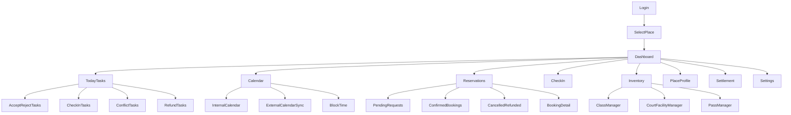
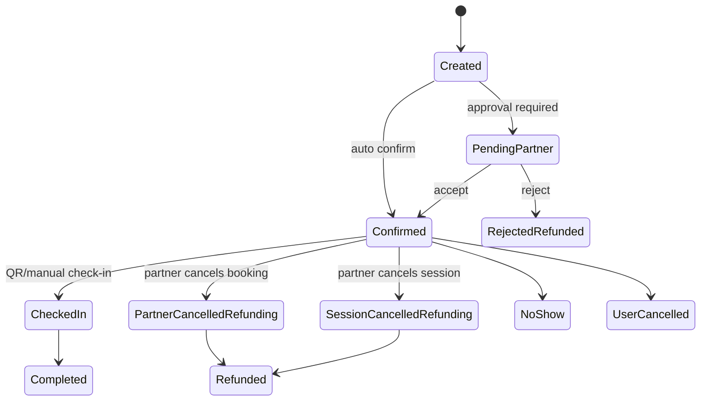

# DUDO Partner Portal PRD

Product Requirement Document สำหรับฝั่ง Partner Portal ที่เชื่อมกับ DUDO User App  
วันที่: 2026-06-20  
สถานะ: MVP Partner Portal handoff  
ขอบเขต: Partner login, dashboard, place/service management, reservation management, calendar, task management, check-in, user app sync

---

## 1. Product Definition

Partner Portal คือระบบหลังบ้านสำหรับร้าน/สถานที่/สตูดิโอ/คอร์ท/ผู้ให้บริการ wellness ใช้จัดการสิ่งที่ขายบน DUDO และจัดการ booking ที่มาจาก user app

Portal ต้องตอบ 5 งานหลัก:

1. Partner เข้าสู่ระบบและเลือกสาขา/สถานที่ที่ดูแล
2. Partner สร้างและแก้ไขข้อมูลสถานที่ รวมถึง section ที่แสดงใน user app
3. Partner สร้างและจัดการ inventory 3 แบบ: Class, Court/Facility, Pass
4. Partner จัดการ reservation: accept, reject, cancel ทั้งระดับ session และ booking รายคน
5. Partner เชื่อม calendar และ task management เพื่อให้ทีมหน้าร้านจัดการงานประจำวันได้จริง

Portal ไม่ใช่แค่ admin form แต่เป็น operational console ที่มีผลโดยตรงกับ user app:

- ถ้า partner เปลี่ยน availability ฝั่ง user ต้องเห็นเวลาว่าง/ไม่ว่างถูกต้อง
- ถ้า partner accept booking ฝั่ง user ต้องเห็น confirmed
- ถ้า partner reject/cancel booking ฝั่ง user ต้องเห็น rejected/cancelled/refunded พร้อม full refund
- ถ้า partner cancel ทั้ง session ฝั่ง user ทุก booking ใน session ต้องถูกแจ้งและ refund ตาม policy
- ถ้า partner block calendar ฝั่ง user ต้องไม่สามารถจองช่วงนั้นได้

---

## 2. Portal Users and Roles

### 2.1 Role Matrix

| Role | Who | Permissions |
|---|---|---|
| Partner Owner | เจ้าของธุรกิจหรือ admin สูงสุดของ partner | จัดการทุกอย่าง, payout, staff, policy, place profile, inventory, calendar, booking |
| Branch Manager | ผู้จัดการสาขา | จัดการ schedule, availability, booking, calendar, staff view เฉพาะสาขา |
| Front Desk / Reception | พนักงานหน้าร้าน | ดู booking วันนี้, accept/reject ถ้าได้รับสิทธิ์, check-in, manual code, task list |
| Instructor / Coach | ครูหรือโค้ช | ดู roster ของ class ตัวเอง, mark attendance optional |
| Finance Viewer | ฝ่ายบัญชี | ดู settlement, refund, payout แต่แก้ inventory ไม่ได้ |
| DUDO Admin Impersonation | ทีม DUDO support | เข้า view เพื่อช่วย debug โดยมี audit log |

### 2.2 Permission Rules

- ทุก action สำคัญต้องมี audit log
- Role ต่ำกว่า Manager ห้ามแก้ price หรือ cancellation policy
- Front Desk จะ reject/cancel booking ได้เฉพาะถ้า Owner/Manager เปิด permission
- Finance Viewer ห้ามเห็น health/user private data
- Instructor เห็นเฉพาะชื่อผู้จองและ class roster ที่เกี่ยวกับตัวเอง

---

## 3. High-Level Portal IA



---

## 4. Login and Access Flow

### 4.1 Goal

Partner ต้องเข้า portal ได้ง่าย ปลอดภัย และเลือกสาขาที่กำลังจัดการได้ชัดเจน

### 4.2 Login Methods MVP

MVP should support:

- Email + password
- Magic link optional
- Invite link for staff

Later:

- Google Workspace login
- SSO for large partner

### 4.3 Login Flow

1. Partner opens portal
2. Enter email/password
3. Backend validates account
4. If account belongs to multiple organizations, show organization selector
5. If organization has multiple places/branches, show place selector
6. Portal opens Dashboard for selected place
7. User role permissions are loaded

### 4.4 Invite Staff Flow

1. Owner/Manager opens Settings > Staff
2. Click Invite Staff
3. Enter email, role, place access
4. System sends invite
5. Staff opens invite
6. Staff creates password
7. Staff can access only permitted modules

### 4.5 Behind The Scenes

Backend must store:

- partner_org
- partner_place
- staff_user
- role
- permissions
- invitation status
- last login
- audit logs

Security:

- Session expiry
- Password reset
- Rate limit login
- Audit failed login attempts

### 4.6 Acceptance Criteria

- Partner can login and select branch
- Staff sees only permitted modules
- Disabled staff cannot login
- Every login and major action is audit logged

---

## 5. Dashboard

### 5.1 Goal

Dashboard ไม่ต้องเป็น analytics ลึกมากใน MVP แต่ต้องให้ partner รู้ว่าวันนี้ต้องจัดการอะไรบ้าง

Dashboard is an operational overview, not full BI.

### 5.2 Dashboard Sections

#### A. Today Overview

Show:

- Today's confirmed bookings
- Pending booking requests
- Check-ins remaining
- Cancellations/refunds today
- Available court blocks today
- Pass redemptions today

#### B. Action Required

Task cards:

- Pending requests to accept/reject
- Calendar conflicts
- Session cancellation confirmations
- Refund failed/pending
- Check-in manual review
- External calendar sync issue

#### C. Today Schedule

Compact timeline:

- class sessions
- court reservations
- pass expected redemptions
- blocked times
- cancelled sessions

#### D. Quick Actions

- Create class session
- Add court block
- Create pass
- Block time
- Scan check-in
- Open pending requests

#### E. Basic Performance

MVP only:

- Bookings this week
- Attendance rate
- Revenue estimate
- Credit consumption
- Refund count

### 5.3 Dashboard Data Source

Dashboard should aggregate:

- bookings
- sessions
- resource availability
- pass purchases/redemptions
- pending tasks
- refund states
- check-in states

### 5.4 Acceptance Criteria

- Dashboard loads under 2 seconds with cached summary
- Partner can see urgent tasks without going into each module
- Numbers link to filtered reservation/task views
- Dashboard respects selected place/branch

---

## 6. Place Profile and Create/Edit Sections

### 6.1 Goal

Partner can create and edit content sections that show on the user app Place Detail page

Place profile is what user sees in DUDO app. Portal must make it clear which fields are public.

### 6.2 Place Profile Sections

Portal should structure place profile into sections:

1. Basic Info
2. Hero and Gallery
3. About
4. Services Section
5. Amenities
6. Opening Hours
7. Location and Contact
8. Policies
9. Visibility and Status

### 6.3 Basic Info

Fields:

- Place name
- Branch name
- Short tagline
- Long description
- Category tags
- Area/neighborhood
- Price level optional
- Public phone
- Public email
- Website/Instagram optional

Rules:

- Name/address changes may require DUDO approval
- Category tags should come from admin taxonomy
- Partner can save as draft before publish

### 6.4 Hero and Gallery

Fields:

- Hero image
- Gallery sections:
  - Studio/Place
  - Training/Class
  - Court/Facility
  - Recovery
  - Amenities
- Image caption optional
- Image sort order

Rules:

- Image upload must validate file type/size
- User app should not show unpublished images
- DUDO admin can remove inappropriate image

### 6.5 About Section

Fields:

- What this place is good for
- Beginner friendly notes
- What to bring
- Arrival instruction
- House rules

### 6.6 Services Section

This section is generated from active services:

- Classes
- Courts/Facilities
- Passes

Partner can reorder service groups if multiple exist

### 6.7 Amenities

Configurable checklist:

- shower
- locker
- parking
- towels
- rental equipment
- cafe
- sauna
- ice bath
- water station
- changing room

### 6.8 Opening Hours

Fields:

- weekly opening hours
- holiday exceptions
- special closures
- branch timezone

User app impact:

- Discovery "Open now"
- Court availability generation
- Pass redemption eligibility

### 6.9 Policies

Policy fields:

- cancellation cutoff
- refund rule
- late arrival rule
- no-show rule
- check-in window
- partner approval timeout

Default policy can be inherited by services, but service can override if permitted

### 6.10 Publish Workflow

Profile states:

- draft
- pending DUDO review
- published
- rejected changes
- archived

Fields that can publish immediately:

- about
- amenities
- gallery order
- phone

Fields requiring DUDO review:

- place name
- address
- legal entity
- payout bank account
- extreme policy changes

### 6.11 Acceptance Criteria

- Partner can edit sections and preview user app view
- Draft changes do not affect user app until published
- DUDO approval fields do not publish immediately
- User app reflects published data only

---

## 7. Inventory Management

Portal must support 3 inventory types:

1. Scheduled Class
2. Court/Facility
3. Pass

## 7.1 Scheduled Class Management

### Goal

Partner can create class templates and schedule sessions with capacity and booking rules

### Class Template Fields

- Class name
- Description
- Category
- Level
- Duration
- Instructor optional
- Default capacity
- Default credit price
- Default cash price
- Payment mode:
  - credits_only
  - cash_only
  - credits_or_cash
- Confirmation mode:
  - auto_confirm
  - partner_approval
- Default cancellation policy
- Images
- Active/inactive

### Create Session Flow

1. Partner opens Inventory > Classes
2. Select class template or create new
3. Click Add Session
4. Select date
5. Select start/end time
6. Set capacity
7. Set instructor
8. Confirm price/payment mode
9. Set confirmation mode
10. Publish session
11. User app sees session availability

### Recurring Session Flow

1. Select class template
2. Click Create Recurring
3. Choose recurrence:
   - weekly
   - selected weekdays
   - date range
4. Review generated sessions
5. Publish

### Edit Session Flow

Editable fields before booking exists:

- time
- capacity
- instructor
- price
- confirmation mode

Editable fields after booking exists:

- instructor
- capacity increase
- notes
- check-in instruction

Restricted after booking exists:

- time changes require notify users
- capacity decrease below booked count forbidden
- price changes affect future bookings only

### Cancel Session Flow

Session cancellation means cancelling the whole class session, not just one booking

1. Partner opens session detail
2. Click Cancel Session
3. Portal shows impact:
   - number of confirmed bookings
   - pending bookings
   - credit refunds
   - cash refunds
   - users to notify
4. Partner selects reason
5. Partner confirms cancellation
6. Backend cancels session
7. Backend cancels all affected bookings
8. Backend triggers refunds
9. User app shows cancelled/refunded
10. Calendar shows cancelled session

Cancel reasons:

- instructor unavailable
- facility issue
- low attendance
- emergency
- schedule error
- other

### Acceptance Criteria

- Session can be created and appears in user app
- Session can be edited with rules
- Session cancellation triggers user notifications and refunds
- Audit log records who cancelled session

---

## 7.2 Court / Facility Management

### Goal

Partner can manage resources such as court, room, lane, bay and their availability

### Resource Fields

- Resource name: Court A
- Resource type: padel_court, tennis_court, room, sauna_room
- Capacity
- Indoor/outdoor
- Active/inactive
- Default booking interval
- Min duration
- Max duration
- Default price

### Availability Generation

Partner can generate availability from:

- opening hours
- resource schedule
- blocked times
- external calendar sync
- manual overrides

### Court Calendar View

Calendar must show:

- rows = resources
- columns = time blocks
- status per block:
  - available
  - booked
  - pending
  - blocked
  - maintenance
  - external busy
  - cancelled

### Block Time Flow

1. Partner opens Court Calendar
2. Select resource and time range
3. Click Block Time
4. Select reason:
   - maintenance
   - private event
   - staff use
   - external booking
   - closed
5. Confirm
6. User app no longer shows that block

### Edit Booking Block Flow

If no booking:

- Partner can change availability/price

If booking exists:

- Partner cannot overwrite block without cancelling booking

### Cancel Court Reservation Flow

Partner can cancel:

- entire resource block if it is a booking
- specific booking only

Steps:

1. Open booking block
2. Click Cancel Booking
3. Show user/payment impact
4. Select reason
5. Confirm
6. Refund triggered
7. User notified
8. Block returns to available or blocked depending reason

### Acceptance Criteria

- User app never shows blocks marked busy/blocked/external busy
- Resource assignment is preserved after booking
- Partner can block time quickly
- Cancelled court booking triggers refund

---

## 7.3 Pass Management

### Goal

Partner can create pass products such as day pass, 3-pass, open gym pass

### Pass Fields

- Pass name
- Description
- Pass type:
  - day_pass
  - multi_pass
  - open_gym_pass
  - facility_pass
- Uses total
- Validity type:
  - selected_date
  - days_after_purchase
  - date_range
- Validity days
- Eligible facilities
- Daily sales limit optional
- Redemption method:
  - QR
  - manual code
- Credit price
- Cash price
- Payment mode
- Refund policy
- Active/inactive

### Create Pass Flow

1. Partner opens Inventory > Passes
2. Click Create Pass
3. Fill pass details
4. Set validity and uses
5. Set price/payment mode
6. Set redemption rule
7. Preview user app card
8. Publish

### Pause Pass Sales Flow

1. Open pass detail
2. Click Pause Sales
3. Existing purchased passes remain valid unless explicitly cancelled
4. User app stops showing pass for sale

### Cancel Purchased Pass Flow

Only Manager/Owner can cancel purchased pass

1. Open purchased pass
2. Click Cancel/Refund
3. Select reason
4. Confirm refund
5. User pass becomes refunded
6. User notified

### Acceptance Criteria

- Pass can be purchased from user app
- Pass can be redeemed by QR/manual code
- Remaining uses update
- Pausing pass stops new purchases but does not break existing passes

---

## 8. Reservation Management

Reservation Management is the most important operational module

### 8.1 Reservation Views

Tabs:

- All
- Pending Requests
- Confirmed
- Today
- Checked In
- No-show
- Cancelled
- Refunded
- Needs Action

Filters:

- date
- inventory type
- service
- payment method
- booking status
- refund status
- user name
- booking code

### 8.2 Booking Detail Page

Must show:

- booking id
- user name
- user contact masked or full based policy
- service name
- inventory type
- date/time
- resource or class session
- payment method
- amount
- current status
- refund status
- check-in status
- source: DUDO app
- action history
- notes

Actions:

- Accept booking
- Reject booking
- Cancel booking
- Mark checked-in
- Mark no-show
- Resend confirmation
- Add internal note

### 8.3 Confirm / Accept Individual Booking

Used when service has `partner_approval`

Flow:

1. Booking arrives as `pending_partner`
2. Task created in Pending Requests
3. Partner opens booking
4. Partner clicks Accept
5. Backend validates slot/resource/pass still available
6. Payment is captured or credits captured
7. Booking becomes confirmed
8. User app updates to confirmed
9. User gets notification

Acceptance criteria:

- Accept disabled if inventory no longer available
- Accept action is audit logged
- User app state updates quickly

### 8.4 Reject Individual Booking

Flow:

1. Partner opens pending booking
2. Click Reject
3. Select reject reason
4. Confirm
5. Backend marks booking rejected
6. Backend voids/refunds payment or releases credits
7. User app shows rejected/refunded
8. Notification sent

Reject reasons:

- slot unavailable
- overbooked
- staff unavailable
- resource maintenance
- user requirement not met
- duplicate booking
- other

Acceptance criteria:

- Reject requires reason
- Refund is automatic
- User sees full refund message

### 8.5 Cancel Confirmed Individual Booking

Partner may need to cancel one booking without cancelling whole session

Examples:

- duplicate reservation
- user requested via phone
- user does not meet requirement
- payment/refund issue
- partner operational issue for only that booking

Flow:

1. Partner opens confirmed booking
2. Click Cancel Booking
3. Portal shows refund impact
4. Partner selects reason
5. Partner confirms
6. Booking becomes partner_cancelled
7. Refund triggered if payment captured/credits deducted
8. User notified
9. Seat/block availability updated depending inventory type

Rules:

- If class booking cancelled, spot may reopen if session still active
- If court booking cancelled, time block may reopen unless reason keeps it blocked
- If pass cancelled, pass becomes refunded and cannot be redeemed

Acceptance criteria:

- Can cancel specific booking without cancelling whole session
- Refund state visible
- Calendar reflects updated availability

### 8.6 Cancel Entire Session

Session means:

- class slot
- court/facility time block with multiple bookings only if group session
- event-like pass redemption slot if applicable

Flow:

1. Partner opens Calendar/Session Detail
2. Click Cancel Session
3. Portal shows affected bookings
4. Portal shows refund total
5. Partner selects reason
6. Partner confirms
7. All active bookings under session cancelled
8. Refund jobs created
9. User notifications sent
10. Session marked cancelled

Acceptance criteria:

- Partner sees impact before confirming
- All affected users get status update
- Refund jobs are idempotent
- Cancelled session no longer bookable

### 8.7 Reservation State Machine



---

## 9. Calendar System

Calendar is important because partner already manages schedules somewhere. Portal must support internal calendar and external calendar connection

### 9.1 Internal Calendar

Internal calendar is the source of truth for DUDO availability after sync/overrides

Views:

- Day view MVP
- Week view P1
- Resource grid for courts/facilities
- Agenda list for front desk

Calendar item types:

- class session
- court booking
- pass redemption
- blocked time
- external busy
- pending request
- cancelled item

### 9.2 Internal Calendar Actions

- create session
- edit session
- cancel session
- block time
- unblock time
- open booking detail
- mark check-in
- create internal task

### 9.3 External Calendar Sync

Purpose:

Many partners already manage schedule in Google Calendar, Apple Calendar, Outlook, or another tool. DUDO should not force double work forever

MVP recommendation:

- Start with Google Calendar 1-way busy import or 2-way iCal feed if easier
- DUDO internal calendar remains booking source of truth

External calendar options:

#### Option A: Read-only Busy Import

DUDO reads external busy blocks and marks DUDO availability as unavailable

Pros:

- safer
- less risk of overwriting external calendar

Cons:

- DUDO bookings may not appear in external calendar unless export feed exists

#### Option B: DUDO Calendar Export

DUDO provides iCal feed URL that partner can subscribe to

Pros:

- easy to add to existing calendar
- low write-risk

Cons:

- refresh interval controlled by external calendar app

#### Option C: Two-way Calendar Sync

DUDO reads external busy and writes DUDO booking to external calendar

Pros:

- best operationally

Cons:

- more complex conflict handling
- requires stronger permissions

MVP should support A + B first, C later

### 9.4 Calendar Conflict Rules

Conflict examples:

- External calendar busy overlaps DUDO available block
- DUDO booking exists but external calendar later marks busy
- Partner edits external event after DUDO booking

Conflict handling:

- Create task in Task Management
- Do not auto-cancel confirmed booking unless partner confirms
- Prevent new bookings on conflicted future availability
- Show conflict badge on calendar

### 9.5 Calendar Sync Data

Fields:

- provider
- connected account
- sync direction
- last_sync_at
- sync status
- external_event_id
- mapped resource/service
- conflict state

### 9.6 Acceptance Criteria

- Partner can see DUDO bookings on internal calendar
- Partner can block time and user app availability updates
- External busy blocks can hide availability
- Calendar conflicts create tasks
- Confirmed DUDO bookings are not silently cancelled by external sync

---

## 10. Task Management

### 10.1 Goal

Task Management gives partner a daily operational to-do list so booking requests, conflicts, check-ins and refunds do not get missed

### 10.2 Task Types

| Task Type | Trigger | Owner |
|---|---|---|
| Accept/Reject Booking | New pending partner booking | Manager/Front Desk |
| Calendar Conflict | External busy overlaps DUDO availability/booking | Manager |
| Check-in Pending | Booking starts soon and user not checked in | Front Desk |
| Manual Check-in Review | Manual code entered or scan failed | Front Desk |
| Session Cancel Impact | Partner starts cancellation flow | Manager |
| Refund Failed | Refund provider failed | Owner/Finance/DUDO Ops |
| Pass Redemption Issue | Pass invalid/expired but user at desk | Front Desk |
| Profile Approval Needed | Partner changed sensitive place field | DUDO Admin |

### 10.3 Task List UI

Task card shows:

- priority
- task type
- related booking/session/resource
- due time
- assigned role/user
- action button
- status

Task statuses:

- open
- in_progress
- resolved
- dismissed
- escalated

### 10.4 Task Detail

Must show:

- context
- suggested action
- related objects
- audit history
- comment/internal note

### 10.5 Task Automation Rules

- New pending booking creates Accept/Reject task
- Task due time = partner approval timeout
- If task expires, booking auto-rejects or escalates based service config
- Calendar conflict task blocks new bookings for affected time if no confirmed booking
- Refund failed task escalates to DUDO Ops

### 10.6 Acceptance Criteria

- Pending bookings appear as tasks
- Calendar conflict creates task
- Resolving task updates related entity if applicable
- Task list can be filtered by Today, Overdue, Needs Action

---

## 11. Check-in Management

### 11.1 Goal

Front desk can verify user attendance and create verified activity in user app

### 11.2 Check-in Methods

- QR scan
- Manual booking code
- Search user/booking

### 11.3 Check-in Flow

1. Staff opens Check-in
2. Scan QR or enter code
3. Backend validates token
4. Portal shows booking summary
5. Staff confirms check-in
6. Booking status becomes checked_in
7. Activity created/updated on user app
8. User can review/share

### 11.4 Invalid Cases

- expired QR
- wrong date/time
- cancelled/refunded booking
- already checked in
- wrong place
- pass no uses remaining

### 11.5 Acceptance Criteria

- Staff can scan and verify within seconds
- Invalid state explains reason
- User app updates after successful check-in
- Audit log records staff user

---

## 12. User App Sync Requirements

Partner Portal and User App must stay in sync

### 12.1 Sync Events

Portal actions publish events:

- `place.updated`
- `service.created`
- `service.updated`
- `session.created`
- `session.updated`
- `session.cancelled`
- `availability.blocked`
- `availability.unblocked`
- `booking.accepted`
- `booking.rejected`
- `booking.cancelled_by_partner`
- `refund.initiated`
- `refund.completed`
- `checkin.verified`
- `pass.redeemed`

### 12.2 User App Effects

| Portal Event | User App Effect |
|---|---|
| place.updated | Place Detail refreshes after publish |
| session.created | New slot appears in Discovery/Place Detail |
| session.cancelled | Booking status cancelled/refunding, user notified |
| availability.blocked | Slot/block hidden from booking |
| booking.accepted | Pending booking becomes confirmed |
| booking.rejected | Booking rejected/refunded |
| booking.cancelled_by_partner | Booking cancelled/refunded |
| checkin.verified | Activity becomes verified/completed |
| pass.redeemed | Pass uses remaining decreases |

### 12.3 Real-time vs Polling

MVP can use:

- API polling for user booking status
- push notification for important updates
- webhook/event bus internally for backend modules

Near-real-time needed for:

- booking accept/reject
- refund state
- check-in verification

### 12.4 Acceptance Criteria

- User never sees confirmed if partner has rejected
- User receives refund status
- Discovery does not show blocked slots
- Check-in verification appears in Activity

---

## 13. Notifications

### 13.1 Partner Notifications

Channels MVP:

- portal notification bell
- email

Later:

- LINE
- Slack
- push app

Partner notification triggers:

- new pending booking
- booking about to expire
- user cancelled booking
- refund failed
- calendar conflict
- check-in issue

### 13.2 User Notifications From Partner Actions

Triggers:

- booking accepted
- booking rejected
- booking cancelled by partner
- session cancelled
- refund initiated
- refund completed
- schedule changed

### 13.3 Acceptance Criteria

- Important partner tasks generate portal notification
- User-facing cancellation/rejection notifications are sent
- Notification copy includes booking/service name and refund expectation

---

## 14. Settlement and Reporting MVP

### 14.1 Goal

Partner needs basic confidence on business activity, not full finance suite

### 14.2 Dashboard Metrics

- bookings count
- attendance count
- no-show count
- cash revenue via DUDO
- credits consumed
- refunds count/amount
- estimated payout

### 14.3 Settlement Table

Rows:

- date
- booking id
- service
- payment method
- gross amount
- DUDO fee optional
- refund amount
- net amount
- payout status

### 14.4 Acceptance Criteria

- Partner can see refund impact
- Finance Viewer can export CSV
- Numbers match booking/payment records

---

## 15. Audit Logs

Every critical action must create audit log:

- login
- profile publish
- price change
- create/edit/cancel session
- block/unblock time
- accept/reject booking
- cancel booking
- cancel session
- check-in verification
- refund action
- staff role change
- calendar sync setting change

Audit fields:

- actor_user_id
- actor_role
- organization_id
- place_id
- action
- object_type
- object_id
- before
- after
- timestamp
- ip/device optional

---

## 16. API Requirements

### 16.1 Auth and Staff

- `POST /partner/auth/login`
- `POST /partner/auth/logout`
- `GET /partner/me`
- `GET /partner/organizations`
- `GET /partner/places`
- `POST /partner/staff/invite`
- `PATCH /partner/staff/:id`

### 16.2 Place Profile

- `GET /partner/places/:placeId`
- `PATCH /partner/places/:placeId`
- `POST /partner/places/:placeId/publish`
- `GET /partner/places/:placeId/audit-log`

### 16.3 Inventory

- `GET /partner/places/:placeId/services`
- `POST /partner/places/:placeId/services`
- `PATCH /partner/services/:serviceId`
- `POST /partner/services/:serviceId/sessions`
- `PATCH /partner/sessions/:sessionId`
- `POST /partner/sessions/:sessionId/cancel`
- `POST /partner/resources`
- `PATCH /partner/resources/:resourceId`
- `POST /partner/resources/:resourceId/block-time`
- `DELETE /partner/blocks/:blockId`
- `POST /partner/passes`
- `PATCH /partner/passes/:passId`

### 16.4 Reservations

- `GET /partner/bookings`
- `GET /partner/bookings/:bookingId`
- `POST /partner/bookings/:bookingId/accept`
- `POST /partner/bookings/:bookingId/reject`
- `POST /partner/bookings/:bookingId/cancel`
- `POST /partner/bookings/:bookingId/no-show`
- `POST /partner/bookings/:bookingId/note`

### 16.5 Calendar

- `GET /partner/calendar`
- `POST /partner/calendar/block`
- `POST /partner/calendar/sync/connect`
- `PATCH /partner/calendar/sync/settings`
- `GET /partner/calendar/conflicts`

### 16.6 Tasks

- `GET /partner/tasks`
- `GET /partner/tasks/:taskId`
- `POST /partner/tasks/:taskId/resolve`
- `POST /partner/tasks/:taskId/dismiss`
- `POST /partner/tasks/:taskId/comment`

### 16.7 Check-in

- `POST /partner/checkins/verify-qr`
- `POST /partner/checkins/manual-code`
- `GET /partner/checkins/today`

### 16.8 Settlement

- `GET /partner/settlement/summary`
- `GET /partner/settlement/transactions`
- `GET /partner/settlement/export`

---

## 17. Data Model Additions

### Partner Organization

```json
{
  "id": "org_123",
  "name": "Racquet Group",
  "status": "active",
  "default_timezone": "Asia/Bangkok"
}
```

### Partner Staff

```json
{
  "id": "staff_123",
  "org_id": "org_123",
  "email": "frontdesk@example.com",
  "role": "front_desk",
  "place_ids": ["place_123"],
  "status": "active"
}
```

### Session

```json
{
  "id": "session_123",
  "service_id": "service_123",
  "place_id": "place_123",
  "starts_at": "2026-08-12T18:00:00+07:00",
  "ends_at": "2026-08-12T19:30:00+07:00",
  "capacity": 12,
  "booked_count": 4,
  "status": "active"
}
```

### Calendar Block

```json
{
  "id": "block_123",
  "place_id": "place_123",
  "resource_id": "resource_123",
  "starts_at": "2026-08-12T10:00:00+07:00",
  "ends_at": "2026-08-12T11:00:00+07:00",
  "reason": "maintenance",
  "source": "partner_manual",
  "status": "active"
}
```

### Task

```json
{
  "id": "task_123",
  "place_id": "place_123",
  "type": "accept_reject_booking",
  "priority": "high",
  "status": "open",
  "related_booking_id": "booking_123",
  "due_at": "2026-08-12T17:30:00+07:00",
  "assigned_role": "front_desk"
}
```

### External Calendar Connection

```json
{
  "id": "calconn_123",
  "place_id": "place_123",
  "provider": "google_calendar",
  "mode": "read_busy_export_dudo",
  "status": "connected",
  "last_sync_at": "2026-06-20T00:00:00Z"
}
```

---

## 18. MVP Acceptance Criteria

Partner Portal MVP is accepted when:

1. Partner can login and select place/branch
2. Partner can view operational dashboard
3. Partner can edit public place profile sections
4. Partner can create/edit class templates and sessions
5. Partner can cancel whole class session
6. Partner can create/edit court resources and block time
7. Partner can create/edit pass products
8. Partner can accept/reject individual pending booking
9. Partner can cancel a specific confirmed booking
10. Partner can see refund impact before cancel/reject
11. Partner can use internal calendar day view
12. Partner can connect external calendar at least read-busy or iCal export
13. Calendar conflicts create tasks
14. Pending bookings create tasks
15. Staff can check in user by QR/manual code
16. User app booking status updates after partner action
17. Full refund triggers when partner reject/cancel requires refund
18. Audit logs exist for critical actions

---

## 19. Open Product Decisions

Need finalize before build:

1. Partner approval timeout, e.g. 15 minutes, 1 hour, same day
2. Whether pending booking uses payment authorization or immediate capture
3. Which external calendar provider in MVP
4. Whether Front Desk can reject booking by default
5. Whether partner cancellation always full refund or policy-based after confirmed
6. Whether user contact is visible to partner
7. Whether partner can message user in MVP
8. Whether schedule change is allowed after confirmed booking
9. Whether external calendar sync is read-only or two-way in MVP
10. Payout/settlement formula

---

End of Partner Portal PRD.
